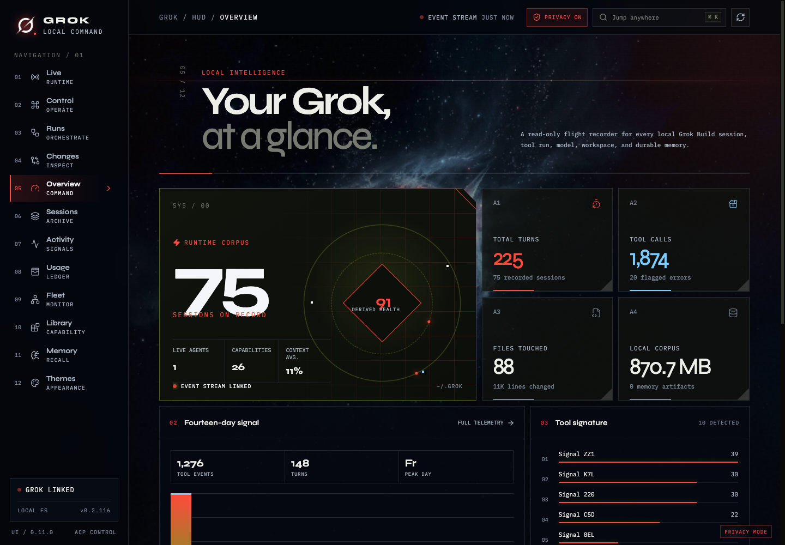
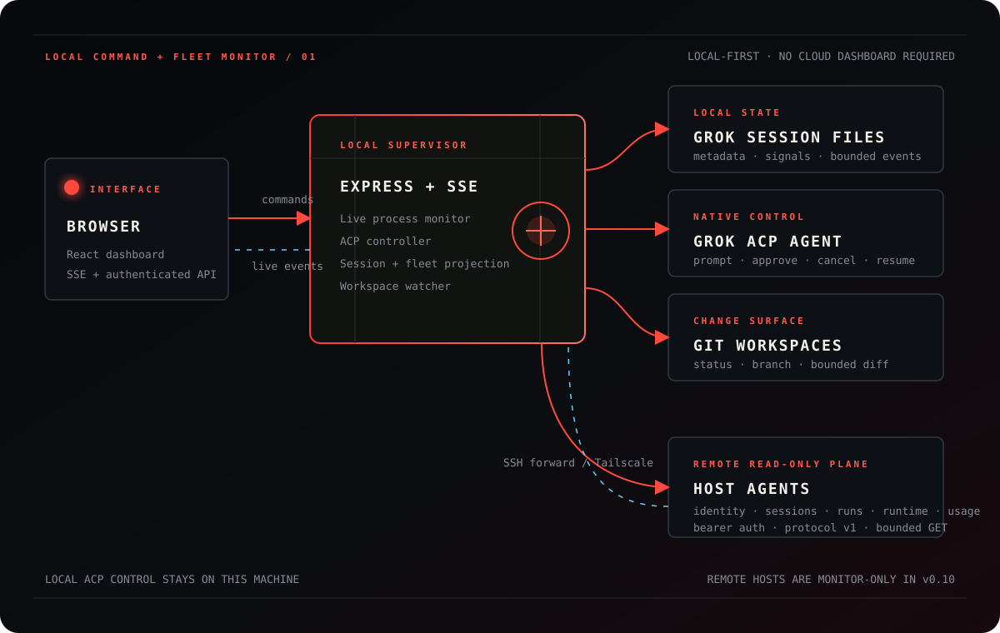

<div align="center">


# Grok UI

**Every Grok session — one living command center.**

An unofficial, local-first dashboard for Grok Build:
watch active agents, control sessions over ACP, inspect Git changes,
and move through your complete local history without leaving the browser.




[**Watch the 24-second product tour**](https://github.com/joeynyc/Grok-UI/releases/download/v0.5.1/grok-ui-dashboard-tour-final-white-logo.mp4)
· [**See what’s new in v0.8.1**](https://github.com/joeynyc/Grok-UI/releases/tag/v0.8.1)
· [**Quickstart**](#quickstart) · [**What it does**](#what-it-does)
· [**Architecture**](#architecture) · [**Security**](#privacy-and-security)

</div>

> [!NOTE]
> Grok UI is an independent community project. It is not affiliated with or endorsed by xAI.

## What it does

<table>
<tr>
<td width="50%" valign="top">

**◉ A runtime that tells the truth**

Active agents come from Grok’s real process registry. Turns, phases,
reasoning, responses, tools, context, and cost updates flow into the
dashboard over one live event stream.

</td>
<td width="50%" valign="top">

**⌘ Native session control**

Create, resume, prompt, approve, and cancel Grok sessions through the
Agent Client Protocol. Permission choices are rendered exactly as Grok
provides them—never guessed or auto-approved.

</td>
</tr>
<tr>
<td width="50%" valign="top">

**◇ One Session Console per agent**

Open any recorded CLI session or managed lane in a clearly labeled Session
Console to chat with the agent, review its activity, inspect changes, manage
permissions, and send follow-ups. Managed sessions survive dashboard restarts.

</td>
<td width="50%" valign="top">

**↗ Git changes as they happen**

The selected repository is watched live. Staged, unstaged, and untracked
files update automatically, with bounded diffs and no manual refresh
required.

</td>
</tr>
<tr>
<td colspan="2" valign="top">

**⌁ Cross-session workflow command field**

Grok Build v0.2.112+ workflow updates become one live run field: phase
progression, per-agent token usage, models, duration, budget use, failures,
results, and safe Pause, Resume, or Stop controls. Searchable, paginated rosters
stay usable as a workflow scales. Failed runs expose recovery only when Grok
reports that the current process can resume them.

</td>
</tr>
</table>

## Architecture

<div align="center">
<a href="https://raw.githubusercontent.com/joeynyc/Grok-UI/main/docs/architecture.svg">

</a>
</div>

Grok UI runs as one local Express supervisor. The browser receives runtime,
control, dashboard, and workspace events over SSE; commands return through
authenticated API routes. Grok credentials never enter the browser.

## Quickstart

### Requirements

- Node.js 22 or newer
- A working [`grok`](https://github.com/xai-org/grok-build) installation
- Grok Build account access

### One-command launch

The packaged release checks its environment, starts the local server, and opens
the dashboard:

```bash
npx --yes grok-ui
```

Run diagnostics without starting the dashboard:

```bash
npx --yes grok-ui doctor
```

### Run from source

```bash
git clone https://github.com/joeynyc/Grok-UI.git
cd Grok-UI
npm ci
npm run doctor
npm start
```

`npm start` creates the production build automatically when it is missing.
For file-watching development, use `npm run dev`.

The versioned delivery plan is maintained in
[`docs/roadmap.md`](docs/roadmap.md).

The first launch opens a live setup diagnostic that distinguishes a missing
CLI, an unauthenticated account, and a profile that simply has not created its
first session yet. Machine-specific paths are never included in those checks.

### CLI options

| Option | Purpose |
| --- | --- |
| `doctor` | Check Node, Grok CLI, authentication, and local state |
| `--port <number>` | Override port `4310` |
| `--host <address>` | Override the loopback bind address |
| `--grok-home <path>` | Use a specific Grok state directory |
| `--state-dir <path>` | Use a specific private Grok UI state directory |
| `--no-open` | Start without opening a browser |
| `--version` | Print the installed Grok UI version |

## Live runtime

Start `grok` in any workspace and the session appears as soon as its live
process registers. The runtime view projects:

- agent state: working, waiting, idle, or needs input
- current phase and active tool
- structured user, assistant, reasoning, plan, and tool events
- turns, tool calls, context usage, and reported cost
- process identity and workspace

Process liveness is rechecked continuously, so “live now” means an open Grok
process—not a recently modified history file.

## Session control

Grok UI supervises `grok agent --no-leader stdio` and communicates through
the official [Agent Client Protocol](https://agentclientprotocol.com/).

It supports new sessions, `session/load`, prompts, permission requests,
confirmed cancellation, and independently running managed lanes. Stop also
cancels pending permissions, preserves final tool updates, surfaces a retry when
Grok does not confirm, and leaves the lane ready to resume. Rename and archive
actions are local Grok UI overlays; Grok’s own session files are never rewritten.

## Workflow runs

The Runs view listens for Grok’s structured `workflow_updated` notifications on
UI-managed ACP sessions and aggregates them across the command field. Each run
can show:

- current status, objective, phase progression, and latest event
- per-agent state, phase, model, duration, and token usage
- active, used, reserved, and total agent allocation
- derived run-wide token totals with explicit incomplete-usage states
- pause context and final result summary
- Pause, Resume, and Stop controls when the run state supports them

Controls use Grok’s documented `/workflow pause|resume|stop <display-name>`
commands and accept only validated display handles. Persisted snapshots remain
visible after a dashboard restart, but their controls are disabled because Grok
only resumes failed or paused workflows inside the process that owns them.

Grok UI intentionally does not scrape the terminal dashboard or imply visibility
into historical CLI-only workflow runs. A run appears after a UI-managed session
emits its first workflow update.

## Usage ledger

The v0.9 Usage view extends the existing token and cost telemetry with a
durable local ledger. It reports by project, model, session, agent, and time
period, while keeping session totals separate from workflow-agent detail.

Every value says whether it is Grok-reported, derived, incomplete, or
unavailable. Grok UI does not substitute context-window occupancy for
cumulative CLI token usage, and explicitly mixed observation scopes are never
presented as precise spend.

## Themes

Two complete visual systems ship with the dashboard:

- **Operator** — carbon black, signal lime, and a precision HUD grid
- **Event Horizon** — deep-space red, cold starlight, and glass command surfaces

Theme selection stays in local browser storage and never changes session data.

## Privacy and security

- The server binds to the loopback interface by default.
- Non-loopback binding requires `GROK_UI_TOKEN`.
- Grok credentials never pass through the browser.
- Persistent Privacy Mode replaces visible session names, paths, identifiers,
  event content, and file names with stable presentation-safe aliases.
- Privacy Mode protects recordings and screen shares; it is not an access-control
  boundary. Authorized browser clients can still receive the underlying local data.
- Authentication cookies are `HttpOnly` and `SameSite=Strict`.
- API responses are non-cacheable and include restrictive security headers.
- Raw system prompts and durable-memory bodies are not indexed.
- File, diff, and event reads are bounded.
- Diff access is restricted to workspaces associated with known sessions.
- Grok UI contains no analytics or product telemetry.
- Repository screenshots and diagrams use sanitized demo data only.

For remote use, set a long random token, place TLS or a private tunnel in
front of the server, and bind only to the interface you intend to expose:

```bash
HOST='<bind-address>' \
GROK_UI_TOKEN='<long-random-token>' \
npm start
```

See [SECURITY.md](SECURITY.md) for the full deployment and reporting guidance.

## Configuration

| Variable | Default | Purpose |
| --- | --- | --- |
| `HOST` | loopback | API bind interface |
| `PORT` | `4310` | API port |
| `GROK_HOME` | `~/.grok` | Grok state directory |
| `GROK_BIN` | `grok` | Grok executable used by the ACP controller |
| `GROK_UI_TOKEN` | empty | Required for non-loopback binding |
| `GROK_UI_STATE_DIR` | `~/.grok-ui` | Private annotations and managed-session state |

## Commands

```bash
npm run dev       # Run API and Vite with file watching
npm run doctor    # Check Node, Grok CLI, authentication, and local state
npm run setup     # Run preflight checks and create a production build
npm run check     # Type-check client and server
npm test          # Run unit and integration tests
npm run test:e2e  # Run production browser onboarding and control tests
npm run build     # Produce client and server builds
npm run verify    # Check, test, and build
npm run release:check # Audit the exact package contents
npm run test:package  # Install and launch the packed artifact in isolation
npm start         # Build when needed, then serve the production app
npm run serve     # Serve an existing production build without rebuilding
```

## Repository map

```text
server/
  grok-controller.ts      ACP lifecycle, prompts, approvals, cancellation
  workflow-state.ts       workflow notification projection and safe controls
  live-monitor.ts         active process and runtime event projection
  usage-ledger.ts         provenance-aware durable usage reporting
  grok-store.ts           historical metadata aggregation
  session-reader.ts       bounded conversation and tool timeline
  session-state.ts        durable managed lanes and local annotations
  workspace-inspector.ts  live Git status and bounded diff inspection
  security.ts             local and remote access gate
src/
  views/ControlView.tsx   command deck and approval queue
  views/WorkflowsView.tsx cross-session workflow command field
  views/UsageView.tsx     time- and dimension-based usage ledger
  views/ChangesView.tsx   live repository change workbench
  views/SessionWorkbench.tsx
                            session timeline and operations
  App.tsx                 dashboard shell and event-stream client
```

The longer design and trust-boundary notes live in
[docs/architecture.md](docs/architecture.md).

## Project status

Grok UI is a release-candidate community project. Its monitor, control,
workbench, and Git inspection paths are functional and covered by automated
tests. The distributable package is also installed and launched in isolation
on macOS and Linux CI before release. Grok Build and ACP evolve quickly, so
compatibility fixes may be needed for future releases.

## License

MIT — see [LICENSE](LICENSE).
